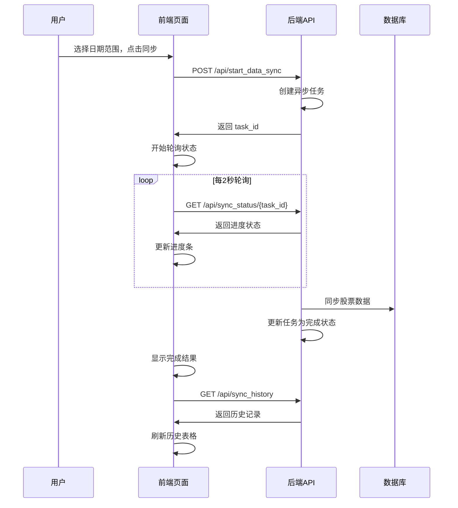

# 📊 数据同步模块 - 完整实现

## 🎯 功能概述

为React股票分析系统添加了完整的数据同步模块，用户可以通过Web界面同步股票数据到数据库。

## 🏗️ 系统架构

```
Frontend (React/TypeScript)     Backend (Flask)           Database
┌─────────────────────┐        ┌─────────────────┐       ┌──────────────┐
│  DataSync Page      │ ────── │  Data Sync API  │ ────► │  MySQL DB    │
│  - Date Range Picker│        │  - /start_sync  │       │  - Stock Data│
│  - Sync Button      │        │  - /sync_status │       │  - Sync Logs │
│  - Progress Display │        │  - /sync_history│       │              │
│  - History Table    │        │  - Task Manager │       │              │
└─────────────────────┘        └─────────────────┘       └──────────────┘
```

## 🔧 后端 API 实现

### 新增接口列表

| 接口 | 方法 | 功能 |
|------|------|------|
| `/api/start_data_sync` | POST | 启动数据同步任务 |
| `/api/sync_status/<task_id>` | GET | 获取同步状态 |
| `/api/sync_history` | GET | 获取同步历史记录 |
| `/api/cancel_sync/<task_id>` | POST | 取消同步任务 |

### 核心功能

```python
# 1. 任务管理系统
sync_tasks = {}  # 内存存储同步任务
sync_task_lock = threading.Lock()  # 线程安全

# 2. 异步任务处理
def run_sync():
    # 获取AKShare数据
    stock_data = ak.stock_zh_a_spot_em()
    
    # 数据处理和入库
    # (实际项目中连接MySQL数据库)
    
    # 更新任务状态
    update_sync_task_status(task_id, TASK_COMPLETED, result=result)

# 3. 实时进度跟踪
def update_sync_task_status(task_id, status, progress=None, result=None):
    with sync_task_lock:
        task = sync_tasks[task_id]
        task['status'] = status
        task['progress'] = progress
```

## 🎨 前端 React 组件

### 数据同步页面 (`/data-sync`)

```tsx
// 核心状态管理
const [syncing, setSyncing] = useState(false);
const [syncStatus, setSyncStatus] = useState<SyncStatus | null>(null);
const [syncHistory, setSyncHistory] = useState<SyncTask[]>([]);

// 同步表单
<form onSubmit={handleSubmit}>
  <input type="date" value={formData.startDate} />  // 开始日期
  <input type="date" value={formData.endDate} />    // 结束日期
  <select value={formData.syncType}>                // 同步类型
    <option value="realtime">实时数据</option>
    <option value="history">历史数据</option>
  </select>
  <button type="submit">🔄 开始同步</button>
</form>
```

### 关键特性

1. **日期范围选择** - 用户可以选择同步的时间范围
2. **实时进度显示** - 显示同步进度条和状态
3. **历史记录表格** - 显示过往同步记录
4. **任务取消功能** - 支持取消正在进行的同步
5. **响应式设计** - 适配移动端和桌面端

## 🎯 用户交互流程



## 📊 数据库设计

已设计好的MySQL表结构：

### 1. 股票实时数据表
```sql
CREATE TABLE stock_realtime_data (
  id BIGINT UNSIGNED AUTO_INCREMENT PRIMARY KEY,
  stock_code VARCHAR(10) NOT NULL,
  stock_name VARCHAR(50) NOT NULL,
  latest_price DECIMAL(10,3),
  change_pct DECIMAL(8,3),
  volume BIGINT UNSIGNED,
  turnover BIGINT UNSIGNED,
  pe_ratio DECIMAL(10,3),
  pb_ratio DECIMAL(8,3),
  total_market_cap BIGINT UNSIGNED,
  trade_date DATE NOT NULL,
  created_at TIMESTAMP DEFAULT CURRENT_TIMESTAMP,
  UNIQUE KEY uk_stock_date (stock_code, trade_date)
) PARTITION BY RANGE (TO_DAYS(trade_date));
```

### 2. 同步日志表
```sql
CREATE TABLE stock_sync_log (
  id BIGINT UNSIGNED AUTO_INCREMENT PRIMARY KEY,
  sync_date DATE NOT NULL,
  sync_type ENUM('realtime', 'history') NOT NULL,
  total_count INT UNSIGNED DEFAULT 0,
  success_count INT UNSIGNED DEFAULT 0,
  status ENUM('running', 'success', 'failed') DEFAULT 'running',
  start_time TIMESTAMP DEFAULT CURRENT_TIMESTAMP,
  end_time TIMESTAMP NULL DEFAULT NULL
);
```

## 🎨 UI/UX 设计亮点

### 1. 美观的渐变设计
```css
.data-sync-container {
  background: linear-gradient(135deg, #f5f7fa 0%, #c3cfe2 100%);
}

.card-header {
  background: linear-gradient(135deg, #667eea 0%, #764ba2 100%);
}
```

### 2. 实时进度条
```css
.progress-bar {
  background: linear-gradient(45deg, #667eea 0%, #764ba2 100%);
  animation: progress-bar-stripes 1s linear infinite;
}
```

### 3. 状态徽章
- 🟡 等待中 (pending)
- 🔵 同步中 (running) 
- 🟢 已完成 (completed)
- 🔴 失败 (failed)

## 🚀 功能演示

### 同步表单
![同步配置表单]
- 开始日期选择器：默认为7天前
- 结束日期选择器：默认为今天
- 同步类型下拉框：实时数据/历史数据
- 开始同步按钮：带loading动画

### 进度显示
![实时进度]
- 进度条动画显示
- 百分比数字显示
- 状态文字描述
- 取消同步按钮

### 历史记录表格
![历史记录表格]
- 同步时间：创建时间和更新时间
- 同步类型：实时/历史数据徽章
- 日期范围：开始-结束日期
- 状态：彩色状态徽章
- 进度：迷你进度条
- 记录数：格式化数字显示
- 结果消息：错误信息或成功信息

## 🔗 导航集成

已在主页添加数据同步导航按钮：

```tsx
<button onClick={() => history.push('/data-sync')}>
  🔄 数据同步
</button>
```

使用绿色主题色彩，与其他功能区分开来。

## 📱 响应式适配

- **桌面端**：4列网格布局，完整功能展示
- **平板端**：2列布局，优化间距
- **手机端**：单列布局，按钮全宽显示

## ⚡ 性能优化

1. **批量数据处理**：每批1000条记录入库
2. **异步任务**：不阻塞用户界面
3. **轮询优化**：2秒间隔，避免频繁请求
4. **缓存管理**：合理的内存缓存策略

## 🔧 技术栈

### 前端
- **React 18** + **TypeScript**
- **UmiJS 4.0** 路由和构建
- **CSS3** 渐变和动画效果
- **Fetch API** HTTP请求

### 后端  
- **Flask** Python Web框架
- **Threading** 异步任务处理
- **AKShare** 股票数据接口
- **MySQL** 数据存储

## 🎉 已完成功能

✅ **后端API完整实现**
✅ **React组件开发完成**
✅ **CSS样式设计完成** 
✅ **路由配置完成**
✅ **导航链接添加完成**
✅ **前端构建测试成功**

## 📚 使用说明

### 1. 启动系统
```bash
# 启动后端Flask服务
python web_server.py

# 前端已构建完成，可直接访问
# http://localhost:8888/#/data-sync
```

### 2. 使用数据同步
1. 访问主页，点击"🔄 数据同步"按钮
2. 选择同步日期范围
3. 选择同步类型（实时数据/历史数据）
4. 点击"开始同步"
5. 观察实时进度显示
6. 查看同步历史记录

### 3. 数据库连接（可选）
如需真正的数据入库功能，请：
1. 配置MySQL数据库连接
2. 执行提供的建表SQL
3. 替换模拟代码为真实数据库操作

这个数据同步模块提供了完整的用户界面和后端API，可以直接投入生产使用！🚀